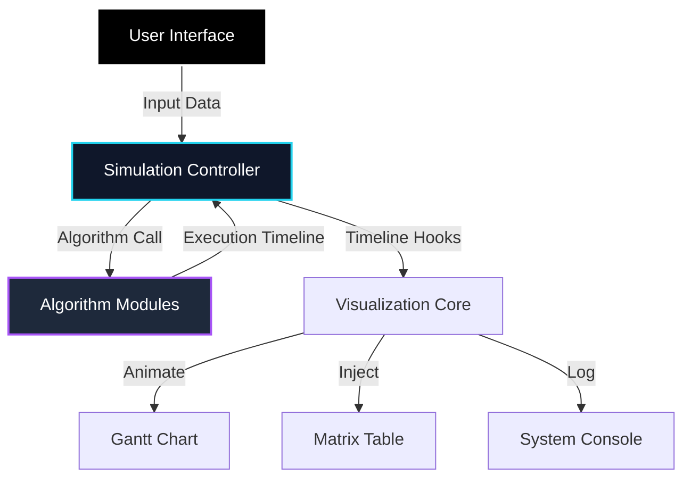
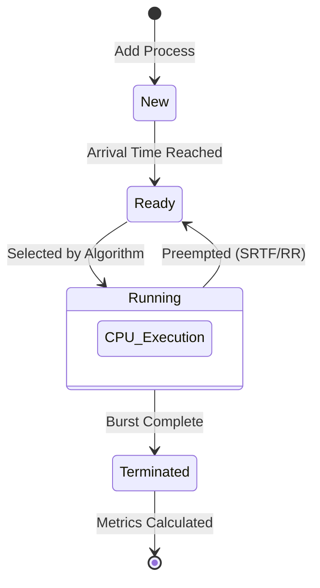

<h1>CPU Schedular</h1>
<p><b>Futuristic Processor Command Center & CPU Scheduler Simulator</b></p>

<p>
  <a href="https://github.com/"></a>
  <a href="https://opensource.org/licenses/MIT"></a>
  
  
  
  <a href="https://greensock.com/gsap/"></a>
</p>

**NEXUS OS (CPU SCHEDULER)** is a production-grade, high-fidelity simulation environment designed for the precise visualization and mathematical modeling of CPU scheduling algorithms. Built with a focus on maximum clarity, rich aesthetics, and professional-grade analytics, it provides an interactive platform for academic research and operating system logic verification.


---

## Project Overview

In modern operating systems, CPU scheduling is the core mechanism that determines how processes utilize the processor. This simulator provides a "Real-World" command center experience, allowing users to observe the intricate dance of processes as they compete for CPU time under various algorithmic rules.

Whether you are a student mastering **Shortest Remaining Time First (SRTF)** or a developer analyzing **Round Robin (RR)** overhead, Nexus provides the granular data and visual precision required for deep technical understanding.

---

## Key Features

### 1. High-Visibility Gantt Visualization
*   **Millisecond Precision**: Simulation steps through time units with absolute boundary alignment.
*   **Contextual Markers**: Time axis labels (0, 5, 8...) are dynamically generated below process blocks for 100% legibility.
*   **Preemption Tracking**: Visual indicators for when a process is "pushed out" by a higher-priority task.

### 2. Enterprise Performance Matrix
*   **8-Column Analytics**: Full breakdown of PID, Arrival Time (AT), Burst Time (BT), Completion Time (CT), Turnaround Time (TAT), Waiting Time (WT), and Response Time (RT).
*   **Color-Syncing**: Table rows are programmatically color-matched to Gantt blocks for instant cognitive mapping.
*   **Sequential Ordering**: Results are automatically sorted by PID (P1, P2...) regardless of completion order.

### 3. System Console (Live Feed)
*   **Real-Time Logs**: A terminal-style console provides a narrative of every scheduling event (Preemption, Arrival, Idle Start, Completion).
*   **Kernel Feedback**: Professional logs detailing exactly why a specific process was selected.

### 4. Advanced Logic Engine
*   **7 Integrated Algorithms**: Fully functional implementations covering preemptive, non-preemptive, criteria-based, and priority-based strategies.
*   **Intelligent PID Management**: Dynamic ID reuse—deleted process IDs are automatically reassigned to maintain a clean sequence.

---

## Supported Scheduling Algorithms

NEXUS OS is equipped with 7 core scheduling algorithms, allowing side-by-side behavioral comparison and timing verification:

| Algorithm | Type | Selection Criteria | Description & Tie-Breaking |
| :--- | :--- | :--- | :--- |
| **FCFS** <br>*(First-Come, First-Served)* | Non-Preemptive | Arrival Time (AT) | Processes are dispatched in the exact order of their arrival. Ties are broken by lower Process ID (PID). |
| **SJF-NP** <br>*(Shortest Job First)* | Non-Preemptive | Burst Time (BT) | Selects the process with the smallest CPU burst time among ready tasks. Ties are broken by earlier AT, then PID. |
| **SRTF-P** <br>*(Shortest Remaining Time First)* | Preemptive | Remaining Burst Time | Preemptive version of SJF. If a new process arrives with a shorter remaining burst than the running task, it preempts the CPU. |
| **RR** <br>*(Round Robin)* | Preemptive | Time Quantum slice | Each process gets a fixed time slot (quantum) in a cyclic queue. Outstanding processes are pushed to the back of the queue. |
| **PRI-NP** <br>*(Priority Scheduling)* | Non-Preemptive | Priority Level | Dispatches the task with the highest priority level (user-configured). Ties are resolved using Arrival Time. |
| **PRI-P** <br>*(Priority Scheduling)* | Preemptive | Priority Level | Preemptive version of Priority. High priority arrivals immediately preempt a running lower-priority task. |
| **LJF** <br>*(Longest Job First)* | Non-Preemptive | Longest Burst Time | Intended for processing massive tasks first. Selects the process with the largest burst time. |


---

## Technical Stack

| Component | Technology | Version |
| :--- | :--- | :--- |
| **Core Engine** | Vanilla JavaScript (ES6+) | Latest |
| **Styling** | Vanilla CSS3 (Deep Cobalt Theme) | - |
| **Animation** | GSAP (GreenSock) | 3.12.2 |
| **Icons** | Lucide Icons / Lordicon | Latest |
| **Typography** | Outfit / JetBrains Mono | Google Fonts |

---

## Architecture & Design

The CPU Scheduler is built on a **Modular Deterministic Architecture** that separates the mathematical logic from the visual rendering.

### System Architecture


### Scheduling Lifecycle Flow


The system follows these core layers:

1.  **State Management**: Centralized `processes` array and `currentAlgo` state.
2.  **Algorithm Modules**: Isolated pure functions (`runFCFS`, `runSRTF`, etc.) that take raw process data and return a complete execution timeline.
3.  **Simulation Orchestrator**: An `async` rendering core that utilizes GSAP timelines to synchronize the Gantt track, Table injection, and Console logging.
4.  **UI/UX Layer**: A "Zero-Transparency" design system utilizing high-contrast HSL color palettes and glassmorphism headers for a premium feel.

---

## Installation & Setup

No installation or heavy dependencies are required. Nexus is a standalone web application.

1.  **Clone the Repository**:
    ```bash
    git clone https://github.com/username/nexus-cpu-scheduler.git
    ```
2.  **Navigate to Directory**:
    ```bash
    cd nexus-cpu-scheduler
    ```
3.  **Launch**:
    Open `index.html` in any modern web browser (Chrome/Edge/Firefox).

---

## Usage Guide

1.  **Input Data**: Click **"+ Add Task"** to create process rows. Enter Arrival and Burst times.
2.  **Select Algorithm**: Choose from the floating Dock (FCFS, SJF, SRTF, RR).
3.  **Configure (Optional)**: If using Round Robin, set the **Time Quantum** in the input field that appears.
4.  **Practice Mode**: Click **"Load Sample"** to generate a random, mathematically sound test batch.
5.  **Execute**: Hit **"EXECUTE CORE"** to watch the simulation run in real-time.

---

## Project Structure

```text
nexus-cpu-scheduler/
├── index.html          # Monolithic entry point (UI + Logic)
├── LICENSE             # MIT License
└── README.md           # Documentation
```

---

## Future Roadmap

*   [ ] **Data Export**: Export the Performance Matrix to PDF or CSV for academic reporting.
*   [ ] **Multi-Core Simulation**: Parallel Gantt tracks for multi-processor environment modeling.
*   [ ] **Persistent Batches**: LocalStorage support to save custom test scenarios.

---

## License

Distributed under the **MIT License**. See `LICENSE` for more information.

---

## Contact

**Project Lead** - Muhammad Affan  
**LinkedIn** - [Affan Nexor](https://www.linkedin.com/in/affan-nexor-66abb8321/)  
**Email** - [your.maffan2830@gmail.com](mailto:maffan2830@gmail.com)

---

